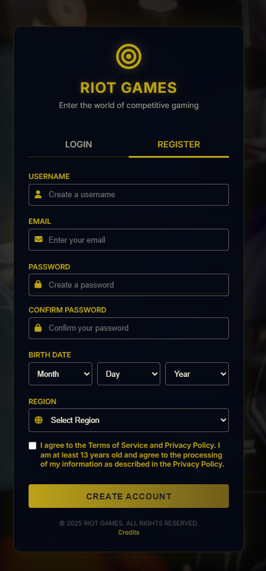

<h1 align="center">Riot Games Login/Registration Page</h1>

This project simulates the login and registration system for **Riot Games**, designed with a modern, responsive user interface. It utilizes HTML, CSS, and JavaScript for dynamic functionality such as form validation, tab switching, and interactive notifications using SweetAlert2.

---

## Features

- **Login & Registration Forms**: Allows users to either log in or create a new account.
- **Smooth Tab Switching**: Switch between the login and registration forms with smooth animations.
- **Social Media Login**: Includes placeholder icons for Google, Facebook, and Apple login.
- **Responsive Design**: Optimized for both desktop and mobile devices.
- **SweetAlert2 Notifications**: Displays stylish success and error alerts after form submissions.
- **Customizable**: Easily modify form actions and add new features.

---

## Demo Preview

### **Login Form**

### **Registration Form**

### **Success Notification**

---

## How to Run

Simply open the `index.html` file in any modern browser to preview the login and registration forms.

---

## Technologies Used

- **HTML5**
- **CSS3**
- **JavaScript (ES6)**
- **SweetAlert2**

---

## License

This project is provided under the MIT License. Feel free to modify and use as needed.

